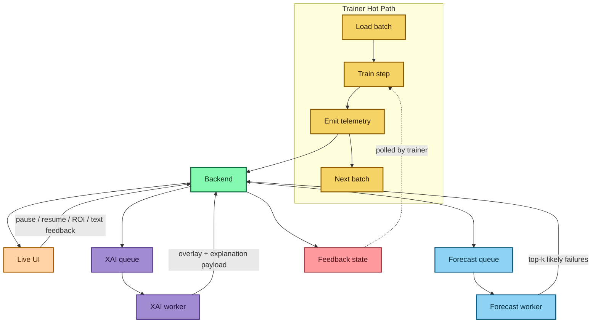

<h1 align="center">Coflect</h1>
<p align="center">Agentic Deep Learning Framework</p>
<p align="center"><strong>HILT</strong> · Human In Loop Training</p>

--------------------------------------------------------------------------------

Coflect is an agentic deep learning framework built for fast, efficient, explainable, and steerable training workflows.
The first module is Human In Loop Training (HILT).

Core principles:
- Trainer hot path stays lightweight (small JSON events only).
- Heavy XAI runs in a separate worker process.
- Visualization and explainability should not block training.

<!-- toc -->

- [More About Coflect](#more-about-coflect)
  - [Non-blocking HILT Architecture](#non-blocking-hilt-architecture)
  - [HILT Flow Diagram](#hilt-flow-diagram)
  - [Live Feedback During Training](#live-feedback-during-training)
  - [Torch-First, Multi-Backend Roadmap](#torch-first-multi-backend-roadmap)
  - [Fast and Lean by Design](#fast-and-lean-by-design)
- [Installation](#installation)
  - [PyPI](#pypi)
  - [From Source (Contributor Setup)](#from-source-contributor-setup)
- [Getting Started](#getting-started)
  - [Notebook Workflows (Primary)](#notebook-workflows-primary)
  - [Quick Demo (CLI)](#quick-demo-cli)
- [Resources](#resources)
- [Releases and Contributing](#releases-and-contributing)
- [License](#license)

<!-- tocstop -->

## More About Coflect

### Non-blocking HILT Architecture

Coflect splits responsibilities across processes:
- backend: event ingest, WebSocket broadcast, feedback storage, XAI queue
- trainer: training loop + lightweight telemetry/XAI requests
- xai worker: attribution rendering outside trainer hot path
- forecast worker: CPU-only top-k likely failure ranking
- UI: live metrics, overlays, pause/resume, ROI and text feedback

### HILT Flow Diagram



Training stays fast because XAI rendering and forecast ranking run asynchronously outside the trainer hot path.

### Live Feedback During Training

Coflect supports live human intervention with:
- text instruction parsing (deterministic parser)
- ROI-guided focus updates
- pause/resume control from the UI
- periodic and mistake-focused XAI request paths

### Torch-First, Multi-Backend Roadmap

Current release line:
- Torch: primary production path
- TensorFlow/Keras: MVP runtime path
- JAX: scaffolded path

### Fast and Lean by Design

- Trainer emits compact events only.
- Heavy operations (XAI render/forecast logic) are offloaded.
- Snapshot sync and XAI requests are asynchronous.

## Installation

### PyPI

```bash
pip install coflect
```

Optional framework extras:

```bash
pip install "coflect[tensorflow]"
pip install "coflect[jax]"
```

Python requirement: `>=3.10`.

### From Source (Contributor Setup)

```bash
git clone https://github.com/Coflect/Coflect.git
cd Coflect
python -m venv .venv
source .venv/bin/activate
pip install -e .
# optional contributor tooling:
# pip install -e .[dev]
# optional framework extras:
# pip install -e .[tensorflow]
# pip install -e .[jax]
```

## Getting Started

### Notebook Workflows (Primary)

Use these notebooks for daily deep learning experiments:

- Torch: `examples/hilt/01_hilt_module_quickstart.ipynb`
- TensorFlow/Keras: `examples/hilt/02_hilt_tensorflow_keras_workflow.ipynb`

Both notebooks include bridge-based UI integration, feedback handling, and Live/XAI wiring.

### Quick Demo (CLI)

For a fast end-to-end demo:

Torch quickstart (CIFAR-10 cat-vs-dog only):

```bash
coflect-hilt-run \
  --backend torch \
  --dataset cifar10_catsdogs \
  --data_root ./data \
  --download_data \
  --steps 5000 \
  --xai_every 100 \
  --forecast_every 20
```

Dataset note:
- class `3` (cat) -> label `0`
- class `5` (dog) -> label `1`

TensorFlow/Keras MVP path:

```bash
coflect-hilt-run \
  --backend tensorflow \
  --steps 5000 \
  --xai_every 100 \
  --forecast_every 20
```

Open UI at `http://localhost:8000`.

## Resources

- Architecture: `docs/ARCHITECTURE.md`
- Support policy: `SUPPORT_MATRIX.md`
- Example index: `examples/README.md`
- HILT examples: `examples/hilt/README.md`
- Release playbook: `docs/RELEASE_PYPI.md`
- Launch checklist: `docs/LAUNCH_CHECKLIST.md`

## Releases and Contributing

- Releases: `https://github.com/Coflect/Coflect/releases`
- Contributing guide: `CONTRIBUTING.md`
- Security policy: `SECURITY.md`
- Code of Conduct: `CODE_OF_CONDUCT.md`

## License

Apache-2.0 (`LICENSE`).
